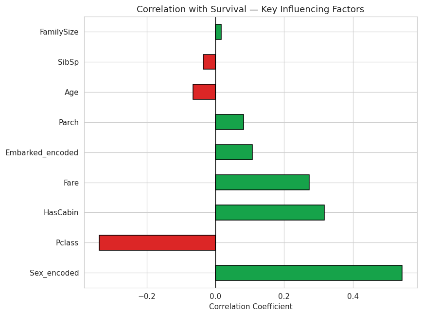

# Titanic — Exploratory Data Analysis (EDA)

Statistical and visual analysis of the Titanic passenger dataset to uncover patterns, trends, and the key factors that influenced survival.

**Full structured findings report: [`REPORT.md`](REPORT.md)**

## Assignment Specification Coverage

Built to satisfy the brief: *"Exploratory Data Analysis (EDA) Project — Analyze a dataset to uncover patterns and trends."*

| Requirement | How it's met |
|---|---|
| **Use statistical summaries and visualizations** | `describe()`, skewness/kurtosis, value counts in `results/statistical_summary.txt`; 4 multi-panel visualizations (correlation heatmap, distribution comparisons, categorical breakdowns, pairplot) |
| **Identify correlations and key influencing factors** | Full correlation matrix + features ranked by correlation strength with survival, saved to `results/key_influencing_factors.csv` and visualized in `correlation_with_survival.png` |
| **Present insights in a structured report** | [`REPORT.md`](REPORT.md) — Executive Summary → Data Overview → Statistical Summary → Correlation Analysis → Key Insights → Conclusion |
| **Develop analytical thinking and data exploration skills** | Report goes beyond raw numbers to interpret *why* patterns exist (e.g. explaining the Fare/Pclass overlap, the non-linear FamilySize effect Pearson correlation misses) |

## Top 3 Key Influencing Factors

| Rank | Factor | Correlation with Survival |
|---|---|---|
| 1 | Sex | +0.543 |
| 2 | Passenger Class | −0.338 |
| 3 | Has Cabin Data | +0.317 |

## Visuals



## Project Structure

```
titanic-eda-analysis/
├── data/
│   └── titanic_cleaned.csv        # Input (from the companion cleaning project)
├── src/
│   └── eda_analysis.py            # Full analysis: stats → correlation → visuals → report data
├── results/
│   ├── statistical_summary.txt
│   ├── correlation_heatmap.png
│   ├── correlation_with_survival.png
│   ├── distributions_by_survival.png
│   ├── categorical_breakdown.png
│   ├── pairplot.png
│   └── key_influencing_factors.csv
├── REPORT.md                      # Structured findings report
├── requirements.txt
├── .gitignore
└── README.md
```

## How to Run

```bash
pip install -r requirements.txt
python src/eda_analysis.py
```

## Tech Stack

`Python` · `pandas` · `NumPy` · `matplotlib` · `seaborn` · `SciPy`

## Related Projects

- [`titanic-analysis`](https://github.com/Devansh004-ops/titanic-analysis) — data cleaning & dashboard
- [`titanic-survival-prediction`](https://github.com/Devansh004-ops/titanic-survival-prediction) — predictive modeling
