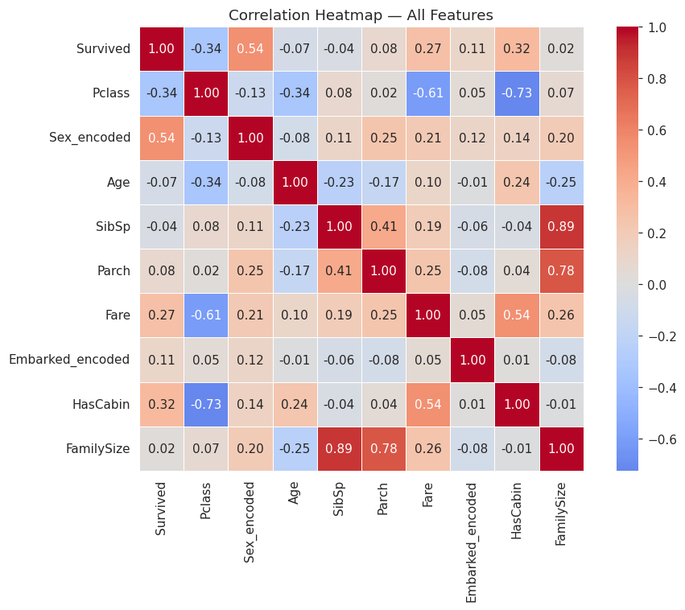
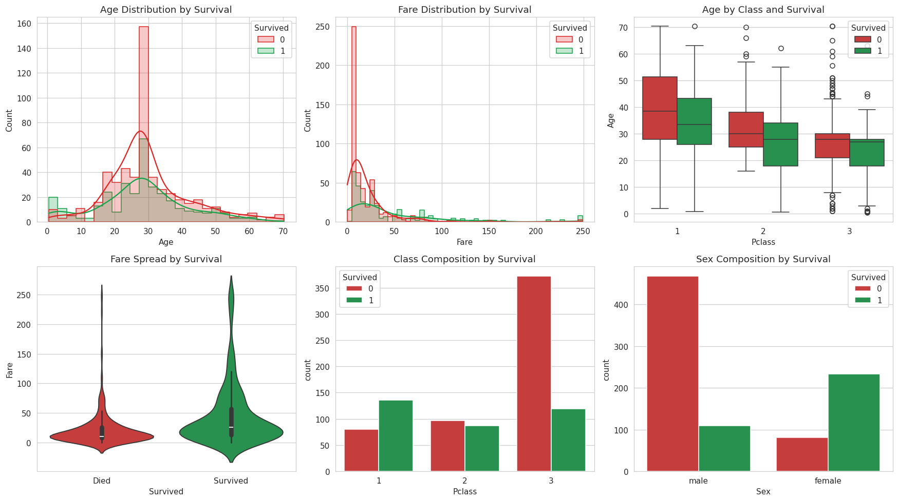
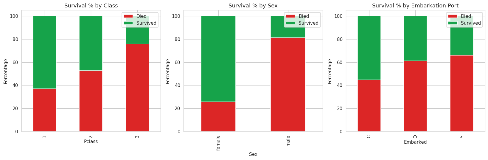
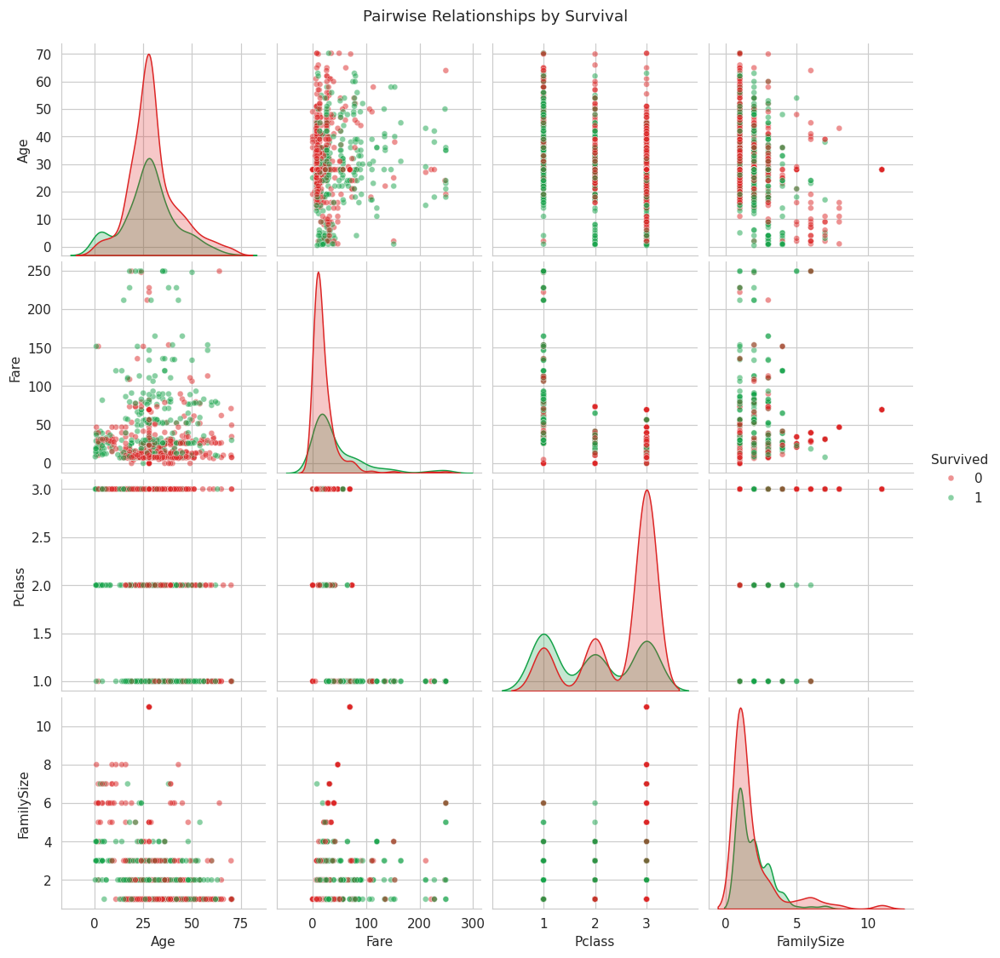

# Exploratory Data Analysis Report: Titanic Passenger Survival

**Dataset:** Titanic passenger manifest (891 records, cleaned)
**Objective:** Identify patterns, trends, and key factors influencing passenger survival
**Method:** Statistical summary, correlation analysis, distribution and categorical visualization

---

## 1. Executive Summary

Of 891 passengers analyzed, **38.4% survived**. The single strongest influencing factor was **sex** (correlation with survival: **0.543**), followed by **passenger class** (-0.338) and **cabin data availability** (0.317, a proxy for wealth/class). The evidence is consistent with the "women and children first" evacuation protocol and the practical reality that higher-class passengers had cabins closer to lifeboat deck access.

## 2. Data Overview

| Property | Value |
|---|---|
| Total passengers | 891 |
| Survival rate | 38.4% (342 survived, 549 did not) |
| Features analyzed | Pclass, Sex, Age, Fare, SibSp, Parch, Embarked, HasCabin, FamilySize |
| Missing data | None (pre-cleaned; see companion cleaning project) |

**Categorical composition:**
- **Class**: 55.1% 3rd class, 24.2% 1st class, 20.7% 2nd class
- **Sex**: 64.8% male, 35.2% female
- **Embarkation**: 72.5% Southampton, 18.9% Cherbourg, 8.6% Queenstown

## 3. Statistical Summary

| Metric | Age | Fare |
|---|---|---|
| Mean | ~29.4 | ~31.5 |
| Median | 28.0 | ~14.5 |
| Std Dev | ~13 | ~46 |
| Skewness | 0.47 (roughly symmetric) | **3.11 (heavily right-skewed)** |
| Kurtosis | 0.84 | 10.97 (extreme tail) |

**Interpretation:** Age is close to a normal distribution with a slight right skew (a few older passengers pull the tail). Fare is heavily right-skewed — most tickets were cheap, but a small number of premium tickets (first-class suites) pull the mean well above the median. This is why **median**, not mean, is the more representative "typical fare" for this dataset.

Full numeric output: [`results/statistical_summary.txt`](results/statistical_summary.txt)

## 4. Correlation Analysis

Correlation of each feature with `Survived`, ranked by strength:

| Rank | Feature | Correlation | Direction |
|---|---|---|---|
| 1 | Sex (female=1) | **+0.543** | Being female strongly increases survival odds |
| 2 | Pclass | **−0.338** | Higher class number (=lower status) decreases survival odds |
| 3 | HasCabin | +0.317 | Having recorded cabin data (proxy for wealth/class) increases odds |
| 4 | Fare | +0.273 | Higher fare paid increases survival odds |
| 5 | Embarked | +0.107 | Weak; port of embarkation had limited independent effect |
| 6 | Parch | +0.082 | Weak positive; traveling with parents/children slightly helps |
| 7 | Age | −0.066 | Weak; younger passengers marginally more likely to survive |
| 8 | SibSp | −0.035 | Negligible |
| 9 | FamilySize | +0.017 | Negligible as a linear correlation — but see note below |

**Important nuance on FamilySize:** its linear correlation is near zero, but the relationship is not actually linear — it's a curve (visible in the earlier dashboard project). Passengers with small families (2–4 people) survived at higher rates than both solo travelers and large families. Pearson correlation, which only measures *linear* relationships, misses this — a good reminder that a low correlation coefficient doesn't always mean "no relationship."

## 5. Key Insights

1. **Sex was the dominant factor.** Women survived at roughly 3–4x the rate of men, consistent with the historical evacuation priority.
2. **Class was a strong secondary factor, largely proxying for physical location on the ship.** First-class cabins were closer to the boat deck; third-class passengers had farther to travel and, per historical accounts, faced more access barriers.
3. **Fare and class tell overlapping stories.** Fare correlates with survival almost as strongly as class does (0.273 vs. −0.338) — unsurprising since fare is essentially a continuous proxy for the same class signal.
4. **Age had a weak individual effect** but interacts with other factors — young children in first/second class had very high survival rates, while young men in third class had very low ones. Age alone isn't very predictive without controlling for class and sex.
5. **Family size shows a non-linear "sweet spot"** — small families outperformed both solo travelers and large families, plausibly because small groups could coordinate an evacuation while staying together, whereas large families struggled to move as a unit and solo travelers had no one advocating for them.

## 6. Conclusion

The Titanic disaster's survival pattern was not random — it was shaped predictably by **sex**, **class**, and **wealth** (fare/cabin), with **family size** playing a secondary, non-linear role. These findings align with the historical record of the "women and children first" protocol and the practical realities of ship geography during evacuation. This EDA identifies the same top features that later prove most important in the companion predictive modeling project — the statistical analysis and the machine learning results independently agree, which is a good sign that the top influencing factors identified here are genuine, not coincidental.

## Related Projects

- [`titanic-analysis`](https://github.com/Devansh004-ops/titanic-analysis) — data cleaning and dashboard visualization (the cleaned dataset used here)
- [`titanic-survival-prediction`](https://github.com/Devansh004-ops/titanic-survival-prediction) — predictive modeling (Logistic Regression, Decision Tree, Random Forest) built on these same insights
